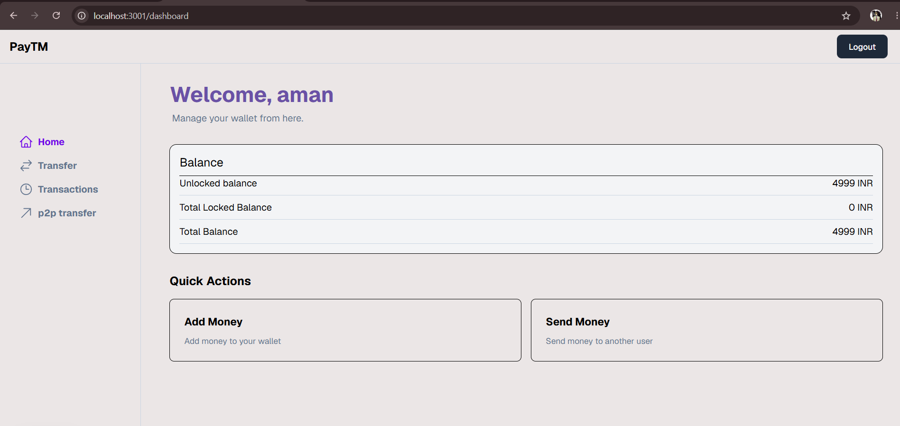
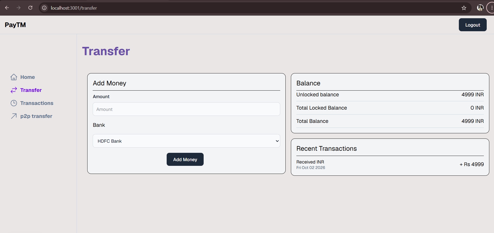

# Payment Wallet App

A Paytm-like digital wallet application built with Next.js, TypeScript, Prisma, and PostgreSQL.

## Features

* User authentication
* Wallet balance management
* Add money through bank webhook
* P2P money transfers
* Transaction history
* Responsive dashboard

## Tech Stack

* Next.js
* TypeScript
* Prisma
* PostgreSQL
* NextAuth
* Zustand
* Tailwind CSS
* Turborepo

## Project Structure

```text
apps/
└── bank_webhook_handler/
└── user-app/


packages/
├── db/
├── store/
└── ui/
```

## How It Works

### Add Money

Users can add money to their wallet through the bank payment flow. The bank sends a webhook after the payment is completed, and the application updates the transaction status and wallet balance.

### P2P Transfer

Users can send money to other users using their phone number. The transfer updates both users' balances inside a database transaction.

## Screenshots

### Dashboard



### Add Money



